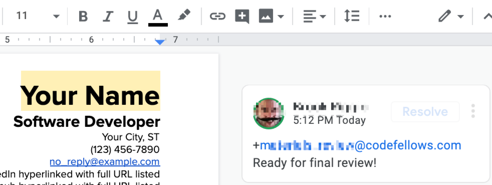

# Finalize Your Materials

It's time to finalize your resume for approval. You're ready! Time to proudly showcase those wonderful projects. 

Once you have completed all updates to your resume, leave a comment tagging the email found below and stating "ready for final review".

If and when approved, your resume will be moved to the approved folder and available to share with partners and your access will be moved to "comment" rights. That allows you the ability to update your resume with new projects, new employment, or education. 

Note: Your resume **must** be approved before you can meet for your Qualifying Interview. Once your resume is approved and you are in the approved folder, you will remain there as a potential candidate infinitely. So, keeping your resume up-to-date is important, even after employment.

## Assignment

Add your 401 projects, making all necessary updates including new tech you've learned since your last update.

Tag the email located below this pane stating that your resume is "ready for final review". 

Submit a screenshot of your resume showing the comment tagging your reviewer. 

 _Allocate 30 minutes to this assignment._

_TA's will be grading you on your submission of your screenshot showing the comment tagging the email for the resume reviewer found below the frame and stating "ready for final review."_
